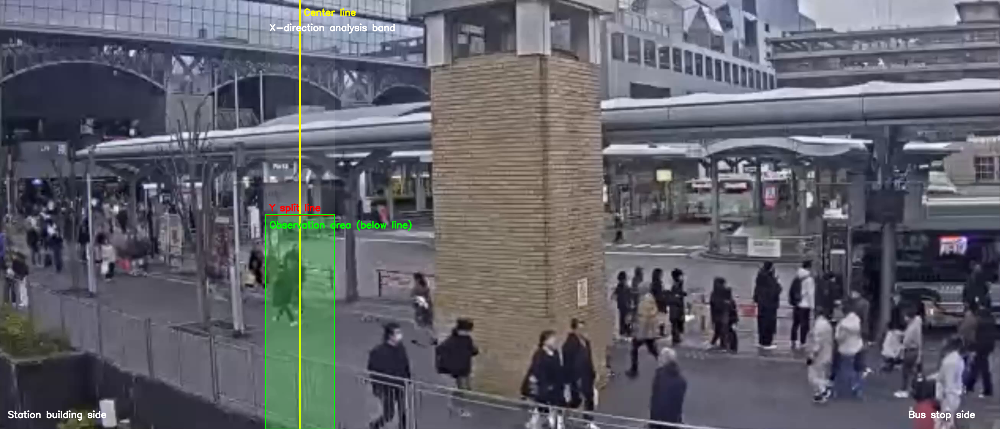

# Kyoto Station Crowd Flow Analysis

## Overview

This project analyzes pedestrian flow around Kyoto Station using a fixed camera video.

The goal is to determine which of the following hypotheses better explains congestion near the station plaza.

- **Hypothesis A (Train-origin flow)**  
  People exiting the station building create congestion.

- **Hypothesis B (Bus-origin flow)**  
  People moving from the bus terminal toward the station create congestion.

To evaluate these hypotheses, this project measures directional pedestrian flow using **optical flow analysis**.

---

# Method

The analysis consists of three main steps.

## 1. Observation Zone Design

Instead of analyzing the entire image, the analysis focuses on a **central horizontal band** where most pedestrian crossings occur.

This reduces the influence of unrelated background motion.

・Yellow line : center reference line

・White band : horizontal observation band

・Red line : vertical split line

・Green area : actual analysis region

## 2. Optical Flow Based Direction Estimation

Optical flow is used to estimate motion between consecutive frames.

In this analysis, only the **horizontal motion component (fx)** is used to determine the flow direction.

### Classification Rule

fx > threshold → A direction (Station → Bus area)

fx < -threshold → B direction (Bus → Station)

The cumulative magnitude of horizontal motion is defined as the **flow index**, which represents the strength of pedestrian flow in each direction.

---

## 3. Noise Reduction

Camera footage includes various small motions unrelated to pedestrian movement, such as:

- tree movement caused by wind  
- lighting changes  
- shadow variations  
- minor camera vibrations  

To reduce these effects, the following techniques are applied:

- **Foreground extraction using MOG2 (background subtraction)**
- **Threshold filtering of horizontal motion magnitude**

These steps help focus the analysis on movements that are more likely to correspond to actual pedestrian motion.

---

# Results

The directional flow is aggregated every **10 seconds**.

### Example Result

| Time Interval | A_flow | B_flow | B/A Ratio | Result |
|---------------|--------|--------|-----------|--------|
| 0–10 sec | 12540 | 8210 | 0.65 | A dominant |
| 10–20 sec | 14120 | 9480 | 0.67 | A dominant |
| 20–30 sec | 10050 | 13980 | 1.39 | B dominant |

---

## Overall Result

Total flow across the entire video:

Total A_flow ≈ 35,648,195

Total B_flow ≈ 34,453,574

B/A ratio ≈ 0.96

### Interpretation

B/A > 1.1 → Bus-origin dominant

B/A < 0.9 → Train-origin dominant

0.9–1.1 → Both factors contribute

Since the B/A ratio is close to **1.0**, the congestion is likely influenced by **both train-origin and bus-origin pedestrian flows**.

---

# Visualization

The following visualization illustrates the analysis results.

The visualization includes:

- observation band  
- flow direction arrows  
- 10-second interval results  

# Robustness Check

To ensure that the conclusions do not depend heavily on specific parameter choices, multiple configurations were tested.

## Parameters Tested

- observation band width  
- flow threshold  
- noise removal (MOG2 on/off)

Across these parameter variations, the overall directional trend remained consistent.

---

# Limitations

This approach has several limitations:

1. The **flow index is not a direct count of people**  
2. Results depend on **camera perspective and viewing angle**  
3. **Standing crowds or stationary congestion** cannot be measured accurately with flow analysis alone

---

# Future Work

Possible improvements and extensions include:

- integrating **train arrival schedule data**
- integrating **bus arrival timing data**
- **multi-camera analysis** for wider spatial coverage
- **pedestrian tracking models** (e.g., YOLO + tracking)

---

# Technologies Used

- Python
- OpenCV
- Optical Flow
- Background Subtraction (MOG2)
- NumPy
- Pandas
